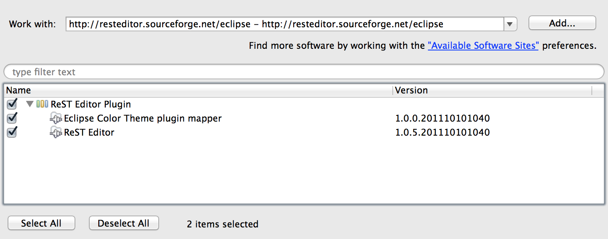

ReStructuredText
################


Eclipse / Aptana Plugin
***********************

``> Help > Install New Software > Add`` 




* update site "ColorTheme" (optional) http://eclipse-color-theme.github.com/update/

* update site "ReST Editor" http://resteditor.sourceforge.net/eclipse

Syntax
******


.. highlightlang:: rest

.. _rst-primer:

reStructuredText Primer
=======================

This section is a brief introduction to reStructuredText (reST) concepts and
syntax, intended to provide authors with enough information to author documents
productively.  Since reST was designed to be a simple, unobtrusive markup
language, this will not take too long.

.. seealso::

   The authoritative `reStructuredText User Documentation
   <http://docutils.sourceforge.net/rst.html>`_.  The "ref" links in this
   document link to the description of the individual constructs in the reST
   reference.


Paragraphs
----------

The paragraph is the most basic block in a reST
document.  Paragraphs are simply chunks of text separated by one or more blank
lines.  As in Python, indentation is significant in reST, so all lines of the
same paragraph must be left-aligned to the same level of indentation.


Inline markup
-------------

The standard reST inline markup is quite simple: use

* one asterisk: ``*text*`` for emphasis (italics),
* two asterisks: ``**text**`` for strong emphasis (boldface), and
* backquotes: ````text```` for code samples.

If asterisks or backquotes appear in running text and could be confused with
inline markup delimiters, they have to be escaped with a backslash.

Be aware of some restrictions of this markup:

* it may not be nested,
* content may not start or end with whitespace: ``* text*`` is wrong,
* it must be separated from surrounding text by non-word characters.  Use a
  backslash escaped space to work around that: ``thisis\ *one*\ word``.
  
  
Example
"""""""

::

   These are *italic*, **bold** and ``code`` 

------------

These are *italic*, **bold** and ``code`` 

------------

Lists and Quote-like blocks
---------------------------

List markup (:duref:`ref <bullet-lists>`) is natural: just place an asterisk at
the start of a paragraph and indent properly.  The same goes for numbered lists;
they can also be autonumbered using a ``#`` sign::

   * This is a bulleted list.
   * It has two items, the second
     item uses two lines.

   1. This is a numbered list.
   2. It has two items too.

   #. This is a numbered list.
   #. It has two items too.
   
------------

* This is a bulleted list.
* It has two items, the second
  item uses two lines.

1. This is a numbered list.
2. It has two items too.

------------


Nested lists are possible, but be aware that they must be separated from the
parent list items by blank lines::

   * this is
   * a list

     * with a nested list
     * and some subitems

   * and here the parent list continues

Definition lists (:duref:`ref <definition-lists>`) are created as follows::

   **term (up to a line of text)**
      Definition of the term, which must be indented

      and can even *consist of multiple* paragraphs

   **next term**
      Description.
      
------------

**term (up to a line of text)**
   Definition of the term, which must be indented

   and can even *consist of multiple* paragraphs

**next term**
   Description.

------------

Note that the term cannot have more than one line of text.

Line blocks  are a way of preserving line breaks::

   | These lines are
   | broken exactly like in
   | the source file.

Source Code
-----------

Literal code blocks are introduced by ending a
paragraph with the special marker ``::``.  The literal block must be indented
(and, like all paragraphs, separated from the surrounding ones by blank lines)::

   This is a normal text paragraph. The next paragraph is a code sample::

      It is not processed in any way, except
      that the indentation is removed.

      It can span multiple lines.

   This is a normal text paragraph again.

The handling of the ``::`` marker is smart:

* If it occurs as a paragraph of its own, that paragraph is completely left
  out of the document.
* If it is preceded by whitespace, the marker is removed.
* If it is preceded by non-whitespace, the marker is replaced by a single
  colon.

That way, the second sentence in the above example's first paragraph would be
rendered as "The next paragraph is a code sample:".


Hyperlinks
----------

External links
^^^^^^^^^^^^^^

Use ```Link text <http://example.com/>`_`` for inline web links.  If the link
text should be the web address, you don't need special markup at all, the parser
finds links and mail addresses in ordinary text.

You can also separate the link and the target definition (:duref:`ref
<hyperlink-targets>`), like this::

   This is a paragraph that contains `a link`_.

   .. _a link: http://example.com/


Sections
--------

Section headers are created by underlining (and
optionally overlining) the section title with a punctuation character, at least
as long as the text::

   =================
   This is a heading
   =================

Normally, there are no heading levels assigned to certain characters as the
structure is determined from the succession of headings.  However, for the
Python documentation, this convention is used which you may follow:

* ``#`` with overline, for parts
* ``*`` with overline, for chapters
* ``=``, for sections
* ``-``, for subsections
* ``^``, for subsubsections
* ``"``, for paragraphs

Of course, you are free to use your own marker characters (see the reST
documentation), and use a deeper nesting level, but keep in mind that most
target formats (HTML, LaTeX) have a limited supported nesting depth.


Images
------

reST supports an image directive, used like so::

   .. image:: eclipse_install.png
      :width: 100 %
      
------


------

When used within Sphinx, the file name given (here ``gnu.png``) must either be
relative to the source file, or absolute which means that they are relative to
the top source directory.  For example, the file ``sketch/spam.rst`` could refer
to the image ``images/spam.png`` as ``../images/spam.png`` or
``/images/spam.png``.


Tables
------

Two forms of tables are supported.  For *grid tables* (:duref:`ref
<grid-tables>`), you have to "paint" the cell grid yourself.  They look like
this::

   +------------------------+------------+----------+----------+
   | Header row, column 1   | Header 2   | Header 3 | Header 4 |
   | (header rows optional) |            |          |          |
   +========================+============+==========+==========+
   | body row 1, column 1   | column 2   | column 3 | column 4 |
   +------------------------+------------+----------+----------+
   | body row 2             | ...        | ...      |          |
   +------------------------+------------+----------+----------+

*Simple tables* (:duref:`ref <simple-tables>`) are easier to write, but
limited: they must contain more than one row, and the first column cannot
contain multiple lines.  They look like this::

   =====  =====  =======
   A      B      A and B
   =====  =====  =======
   False  False  False
   True   False  False
   False  True   False
   True   True   True
   =====  =====  =======

Footnotes
---------

For footnotes (:duref:`ref <footnotes>`), use ``[#name]_`` to mark the footnote
location, and add the footnote body at the bottom of the document after a
"Footnotes" rubric heading, like so::

   Lorem ipsum [#f1]_ dolor sit amet ... [#f2]_

   .. rubric:: Footnotes

   .. [#f1] Text of the first footnote.
   .. [#f2] Text of the second footnote.

You can also explicitly number the footnotes (``[1]_``) or use auto-numbered
footnotes without names (``[#]_``).


Citations
---------

Standard reST citations (:duref:`ref <citations>`) are supported, with the
additional feature that they are "global", i.e. all citations can be referenced
from all files.  Use them like so::

   Lorem ipsum [Ref]_ dolor sit amet.

   .. [Ref] Book or article reference, URL or whatever.

Citation usage is similar to footnote usage, but with a label that is not
numeric or begins with ``#``.


